# HomeAssistant personal config

## Devices

<table align="center" border="0" width="100%">
  <thead>
    <tr>
      <th>Quantity</th>
      <th>Device</th>
      <th>Use</th>
    </tr>
  </thead>
  <tbody>
    <tr>
      <td>1</td>
      <td>
        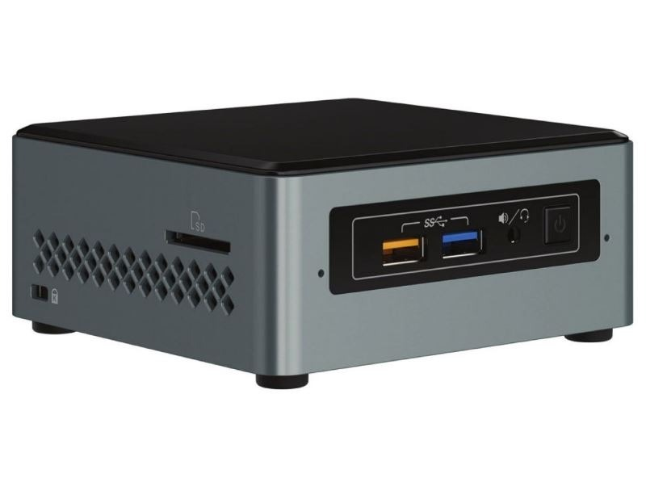
        <h3>Intel NUC J3455</h3>
      </td>
      <td>
        
Ubuntu server running Docker

      </td>
    </tr>
    <tr>
      <td>2</td>
      <td>
        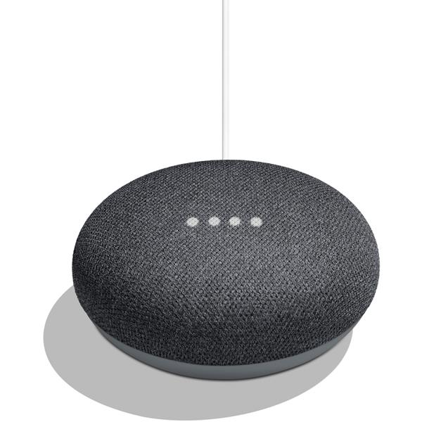
        <h3>Google Home Mini</h3>
      </td>
      <td>
        
Voice Assistant

      </td>
    </tr>
    <tr>
      <td>1</td>
      <td>
        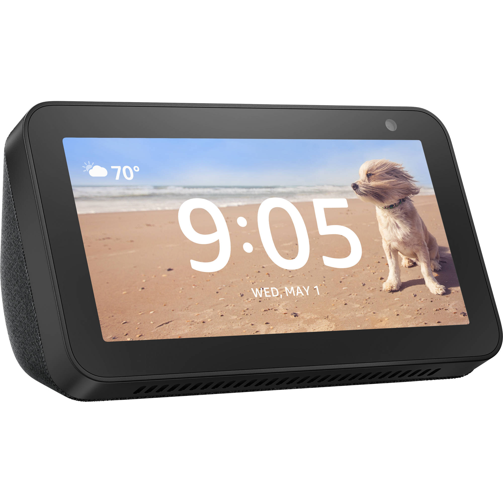
        <h3>Echo show</h3>
      </td>
      <td>
        
Voice Assistant

      </td>
    </tr>
    <tr>
      <td>2</td>
      <td>
        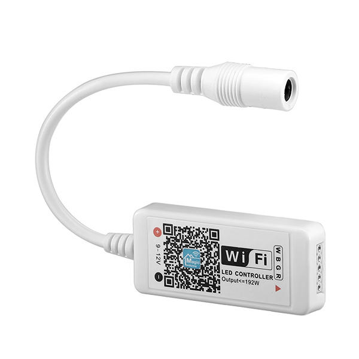
        <h3>LED strip controller</h3>
      </td>
      <td>
        
Lights

      </td>
    </tr>
    <tr>
      <td>2</td>
      <td>
        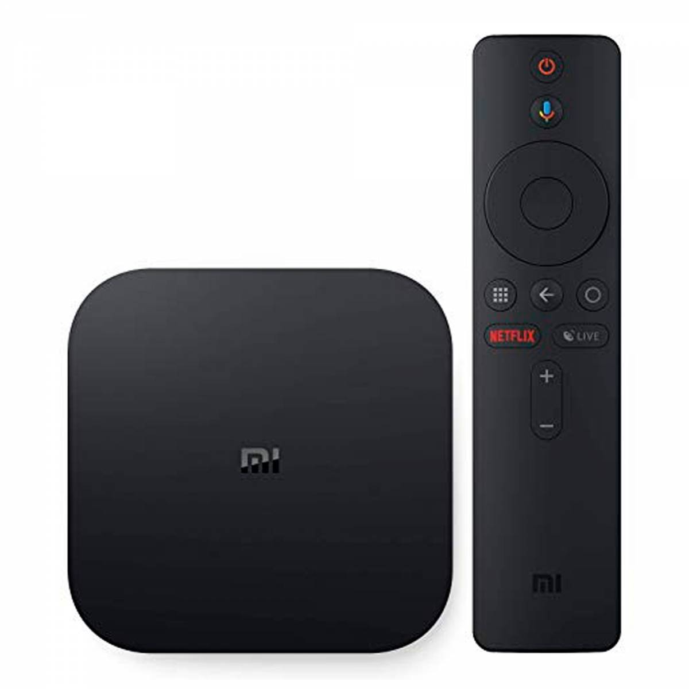
        <h3>Mi Box S</h3>
      </td>
      <td>
        
TV

      </td>
    </tr>
    <tr>
      <td>1</td>
      <td>
        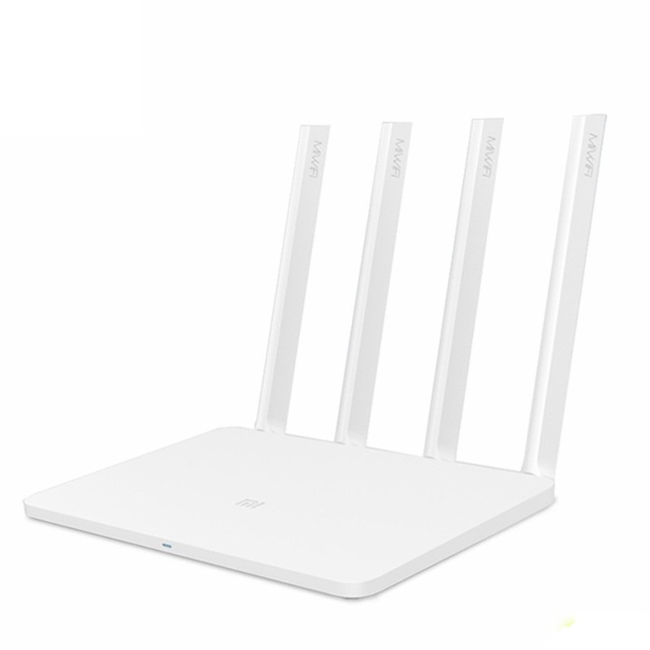
        <h3>Mi WiFi 3</h3>
      </td>
      <td>
        
WiFi router

      </td>
    </tr>
    <tr>
      <td>1</td>
      <td>
        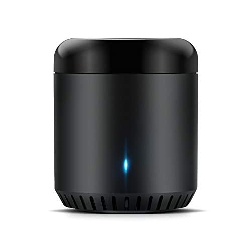
        <h3>RM mini</h3>
      </td>
      <td>
        
IR Blaster

      </td>
    </tr>
    <tr>
      <td>1</td>
      <td>
        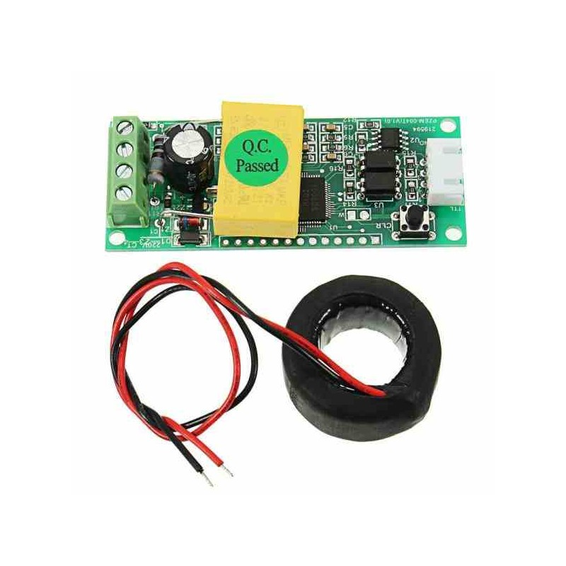
        <h3>PZEM</h3>
      </td>
      <td>
        
Home power meter

      </td>
    </tr>
    <tr>
      <td>3</td>
      <td>
        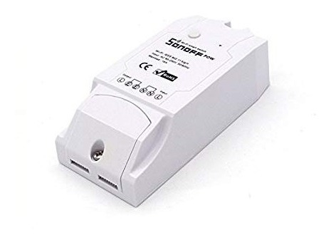
        <h3>Sonoff POW</h3>
      </td>
      <td>
        
Switch / Power meter

      </td>
    </tr>
    <tr>
      <td>4</td>
      <td>
        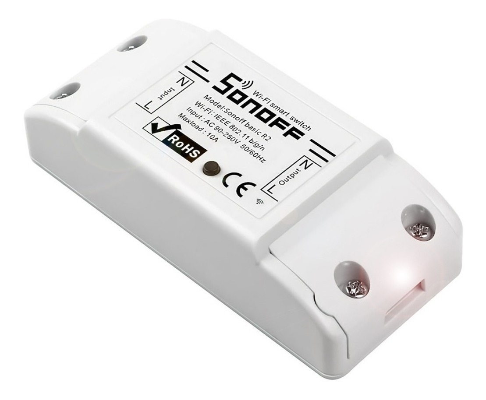
        <h3>Sonoff</h3>
      </td>
      <td>
        
Switch

      </td>
    </tr>
    <tr>
      <td>1</td>
      <td>
        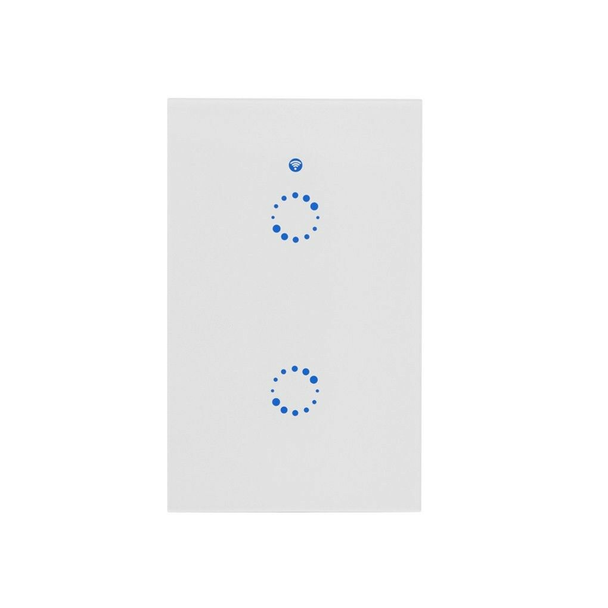
        <h3>Sonoff wall 2 gang</h3>
      </td>
      <td>
        
Lights switch

      </td>
    </tr>
    <tr>
      <td>1</td>
      <td>
        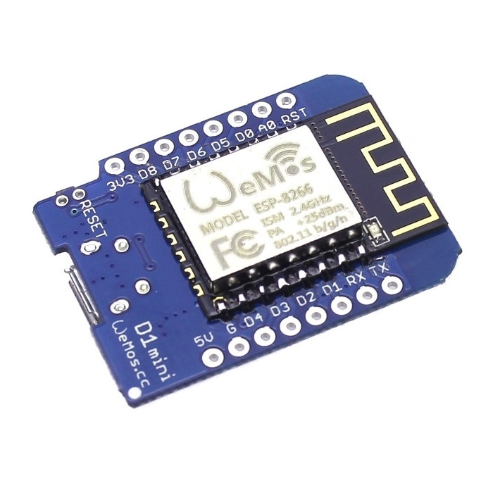
        <h3>Wemos</h3>
      </td>
      <td>
        
Generic

      </td>
    </tr>
    <tr>
      <td>1</td>
      <td>
        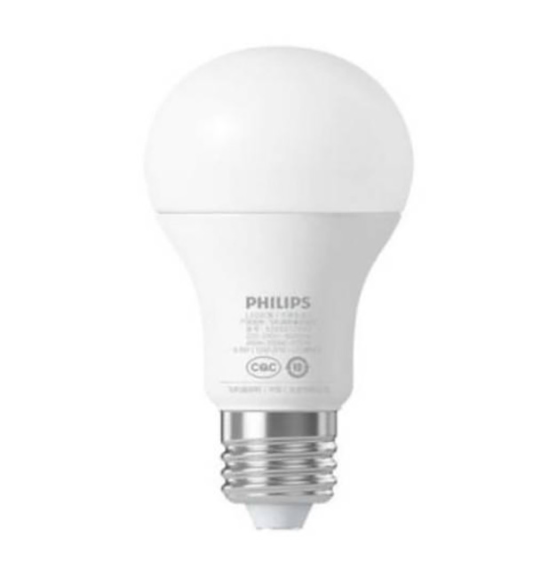
        <h3>Xiaomi Bulb</h3>
      </td>
      <td>
        
Light

      </td>
    </tr>
    <tr>
      <td>2</td>
      <td>
        
        <h3>Xiaomi button</h3>
      </td>
      <td>
        
Action button

      </td>
    </tr>
    <tr>
      <td>1</td>
      <td>
        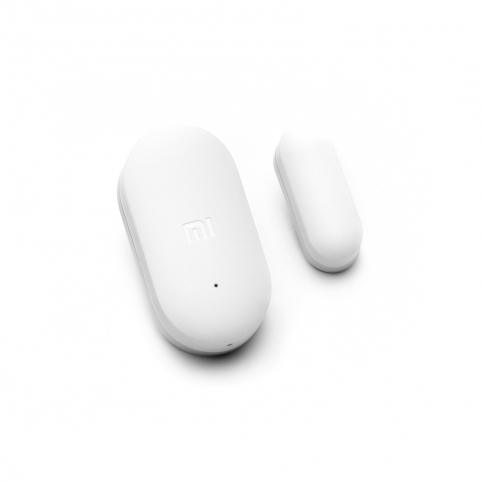
        <h3>Xiaomi door sensor</h3>
      </td>
      <td>
        
Door sensor

      </td>
    </tr>
    <tr>
      <td>1</td>
      <td>
        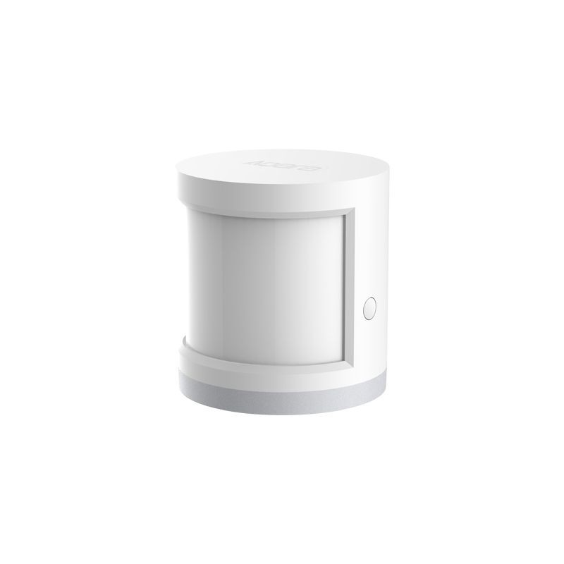
        <h3>Xiaomi motion sensor</h3>
      </td>
      <td>
        
Motion sensor

      </td>
    </tr>
    <tr>
      <td>2</td>
      <td>
        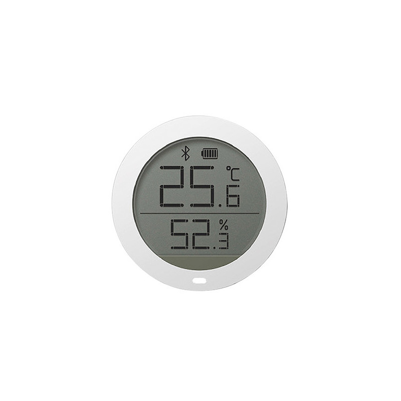
        <h3>Xiaomi temperature/humidity sensor</h3>
      </td>
      <td>
        
Temperature and humidity sensor

      </td>
    </tr>
    <tr>
      <td>2</td>
      <td>
        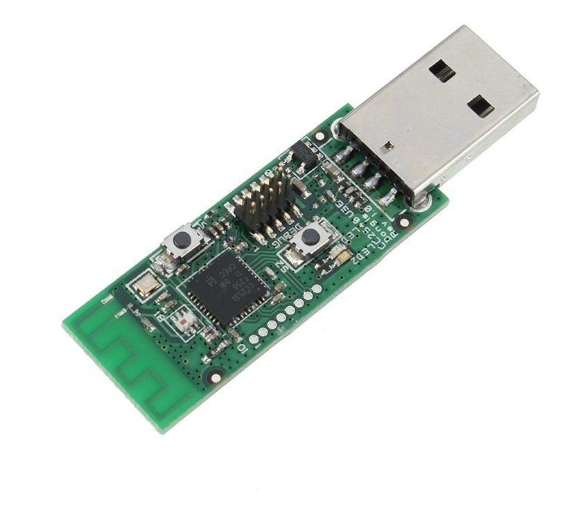
        <h3>CC2531 USB</h3>
      </td>
      <td>
        
Sniffer - Zigbee to MQTT

      </td>
    </tr>
  <tbody>
</table>

