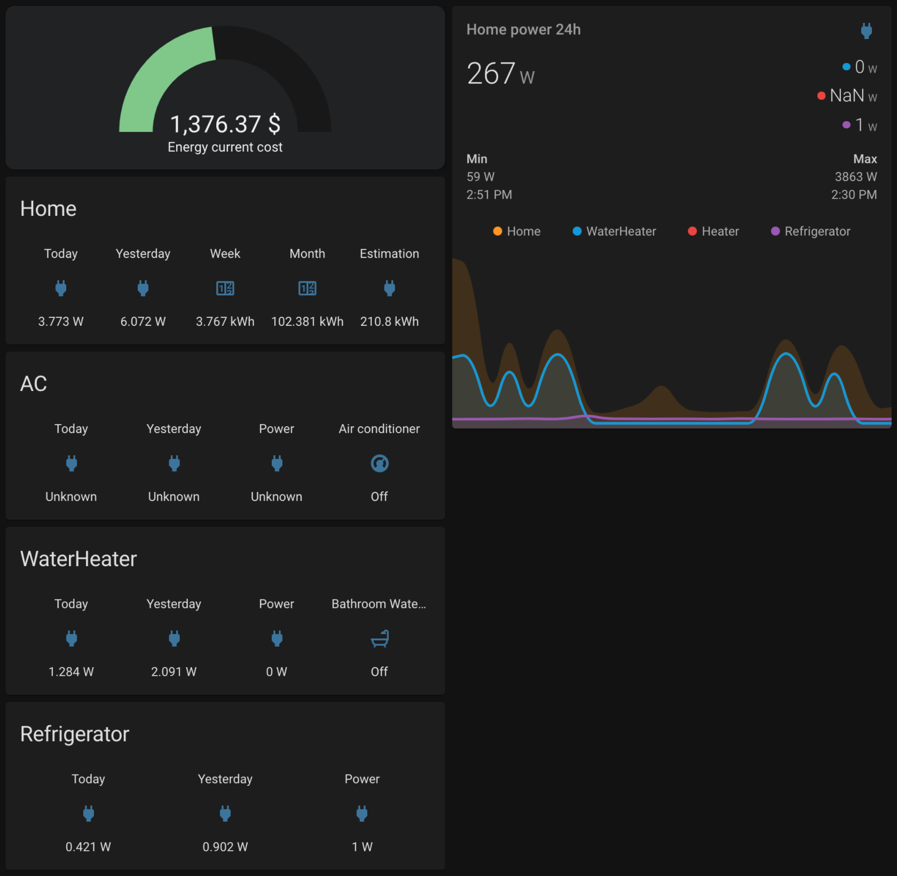
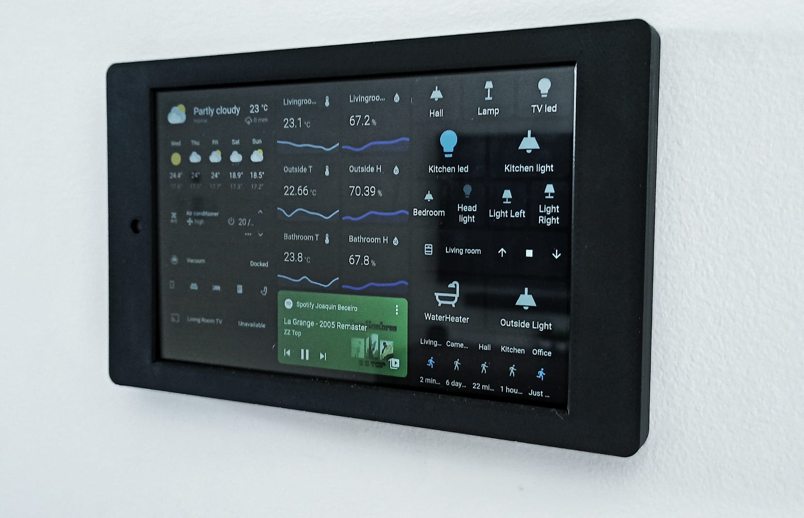
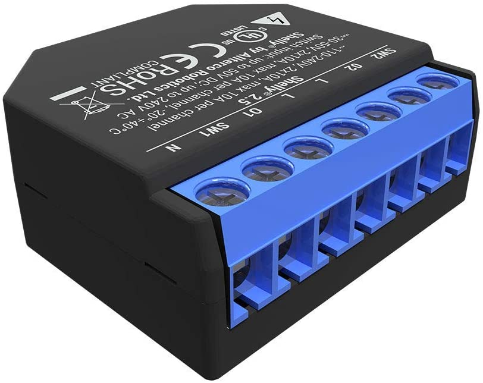

<h1 align="center">HomeAssistant personal config</h1>

<h2 align="center">
  From :uruguay: to :earth_americas: !
</h2>

  This is a project focused on sharing ideas and solutions for the use of <a href="https://www.home-assistant.io/">Home Assistant</a> and home automation in general.
  I am currently running <a href="https://www.docker.com/">Docker</a> on the Mini Intel Nuc Celeron J3455 8gb 1tb.

  I will update my configuration files regularly. If you like what you see, feel fre to :star: my repo!

  
  
  
  

  
  
  
  

**Objectives**

- Energy saving
- Cheap home automation
- Simple user interface
- Daily use automations to simplify the routine

## Table of Contents

- [Screenshots](#screenshots)
- [Photos](#Photos)
- [Software](#software)
- [Devices](#devices)
- [Automations](#automations)
- [Secrets](#secrets)
- [ToDo list](#todo-list)
- [Authors](#authors)

## Screenshots

### Dashboard - Home

### Dashboard - Personal

- Device tracker
- Phone status (location, battery, battery state, geocode and connected WiFi network)
- WIP: Shopping list

### Dashboard - Power consumption

- Online power consumptions cost ($)
- Online power consumptions (Home, AC, WaterHeater and Refrigerator)
- Home power consumption (today, yesterday, week and month)
- AC power consumption (today and yesterday)
- WaterHeater power consumption (today and yesterday)
- Refrigerator power consumption (today and yesterday)
- Last 24h chart of power cnsumptions with max/min values

### Dashboard - Tablet

## Photos

### Tablet

- Wall mounted Tablet with [Fully Kiosk Browser](https://www.fully-kiosk.com/) running HomeAssistant
- Using tablet camera as security camera
- Motion sensor with tablet camera
- Automatic display on/off with motion sensor

## Software

- Docker server with [Portainer](https://www.portainer.io/)
- [Mosquitto](https://mosquitto.org/) MQTT server to communicate with devices
- [MariaDB](https://mariadb.org/) database to save all information
- [VSCode](https://code.visualstudio.com/) server to code in browser
- [ADB](https://developer.android.com/studio/command-line/adb/) server to communicate with AndroidTV devices
- [HomeKit Bridge](https://www.home-assistant.io/integrations/homekit/) to make HomeAssistant entities available on Apple HomeKit

## Devices

<table align="center" border="0" width="100%">
  <thead>
    <tr>
      <th>Quantity</th>
      <th>Device</th>
      <th>Use</th>
    </tr>
  </thead>
  <tbody>
    <tr>
      <td>1</td>
      <td>
        
        <h3>Intel NUC J3455</h3>
      </td>
      <td>
        
Ubuntu server running Docker

      </td>
    </tr>
    <tr>
      <td>2</td>
      <td>
        
        <h3>Google Home Mini</h3>
      </td>
      <td>
        
Voice Assistant

      </td>
    </tr>
    <tr>
      <td>1</td>
      <td>
        
        <h3>Echo show</h3>
      </td>
      <td>
        
Voice Assistant

      </td>
    </tr>
    <tr>
      <td>2</td>
      <td>
        
        <h3>LED strip controller</h3>
      </td>
      <td>
        
Lights

      </td>
    </tr>
    <tr>
      <td>2</td>
      <td>
        
        <h3>Mi Box S</h3>
      </td>
      <td>
        
TV

      </td>
    </tr>
    <tr>
      <td>1</td>
      <td>
        
        <h3>Mi WiFi 3</h3>
      </td>
      <td>
        
WiFi router

      </td>
    </tr>
    <tr>
      <td>1</td>
      <td>
        
        <h3>RM mini</h3>
      </td>
      <td>
        
IR Blaster

      </td>
    </tr>
    <tr>
      <td>1</td>
      <td>
        
        <h3>PZEM</h3>
      </td>
      <td>
        
Home power meter

      </td>
    </tr>
    <tr>
      <td>3</td>
      <td>
        
        <h3>Sonoff POW</h3>
      </td>
      <td>
        
Switch / Power meter

      </td>
    </tr>
    <tr>
      <td>4</td>
      <td>
        
        <h3>Sonoff</h3>
      </td>
      <td>
        
Switch

      </td>
    </tr>
    <tr>
      <td>1</td>
      <td>
        
        <h3>Sonoff wall 2 gang</h3>
      </td>
      <td>
        
Lights switch

      </td>
    </tr>
    <tr>
      <td>1</td>
      <td>
        
        <h3>Wemos</h3>
      </td>
      <td>
        
Generic

      </td>
    </tr>
    <tr>
      <td>1</td>
      <td>
        
        <h3>Xiaomi Bulb</h3>
      </td>
      <td>
        
Light

      </td>
    </tr>
    <tr>
      <td>2</td>
      <td>
        
        <h3>Xiaomi button</h3>
      </td>
      <td>
        
Action button

      </td>
    </tr>
    <tr>
      <td>2</td>
      <td>
        
        <h3>Xiaomi door sensor</h3>
      </td>
      <td>
        
Door sensor

      </td>
    </tr>
    <tr>
      <td>3</td>
      <td>
        
        <h3>Xiaomi motion sensor</h3>
      </td>
      <td>
        
Motion sensor

      </td>
    </tr>
    <tr>
      <td>2</td>
      <td>
        
        <h3>Xiaomi temperature/humidity sensor</h3>
      </td>
      <td>
        
Temperature and humidity sensor

      </td>
    </tr>
    <tr>
      <td>1</td>
      <td>
        
        <h3>CC2531 USB</h3>
      </td>
      <td>
        
Sniffer - Zigbee to MQTT

      </td>
    </tr>
    <tr>
      <td>1</td>
      <td>
        
        <h3>Yi Dome 1080p</h3>
      </td>
      <td>
        
Camera and movement detection

      </td>
    </tr>
    <tr>
      <td>1</td>
      <td>
        
        <h3>Sonoff 4 channel</h3>
      </td>
      <td>
        
4 channel switch

      </td>
    </tr>
    <tr>
      <td>1</td>
      <td>
        
        <h3>Tablet Fire 7</h3>
      </td>
      <td>
        
Dashboard mounted on wall with <a href="https://www.etsy.com/" target="_blank">etsy</a> wall mount

      </td>
    </tr>
    <tr>
      <td>1</td>
      <td>
        
        <h3>Xiaomi Aqara cube</h3>
      </td>
      <td>
        
Remote controller

      </td>
    </tr>
    <tr>
      <td>1</td>
      <td>
        
        <h3>Aqara temperature/humidity sensor</h3>
      </td>
      <td>
        
Outside temperature and humidity

      </td>
    </tr>
    <tr>
      <td>1</td>
      <td>
        
        <h3>Xiaomi Mi Robot Vacuum-Mop Pro</h3>
      </td>
      <td>
        
Clean

      </td>
    </tr>
        <tr>
      <td>1</td>
      <td>
        
        <h3>Shelly 2.5 double relay</h3>
      </td>
      <td>
        
Roller Shutter

      </td>
    </tr>
  <tbody>
</table>

## Automations

### Most important automations

#### [Notify when the water heater is ready](https://github.com/JoaquinBeceiro/home-assistant-config/blob/c82da612f44ed7adee008f6d876e8560fad946e4/config/automations/bathroom.yaml#L20-L68)

##### Automation trigger

Every time Water Heater is turned on, this automation turns on.
The Water Heater has a power meter. When this power meter reads 0w and the switch is on, this automations trigers. This automation only run if time is between **09:00HS** and **05:00HS**.

##### Automation tasks

- Play on Google Home with TTS
- Text notification with Telegram

#### [Notify power consumption daily](https://github.com/JoaquinBeceiro/home-assistant-config/blob/41c0525266fa52f0d7c0c3110407299596538b52/config/automations/energy.yaml#L5-L33)

##### Automation trigger

Every day at **23:59HS**

##### Automation tasks

- Notify each power consumption reads (Heater, WaterHeater and Refrigerator) and total of the current day to Telegram
- [Save power consumptions to Google Spreadsheet](https://github.com/JoaquinBeceiro/home-assistant-config/blob/4cc6b108339242588ebe53619984bc27602b5cb2/config/automations/energy.yaml#L4-L36)

#### [Notify power consumption monthly](https://github.com/JoaquinBeceiro/home-assistant-config/blob/cb9735e2e04e43a8f65ec5079d1865c2396d6d62/config/automations/energy.yaml#L35-L49)

##### Automation trigger

Last day of month at **23:59HS**

##### Automation tasks

- Notify month power consuption to Telegram

#### [Notify when front door is open](https://github.com/JoaquinBeceiro/home-assistant-config/blob/cb9735e2e04e43a8f65ec5079d1865c2396d6d62/config/automations/hall.yaml#L1-L17)

##### Automation trigger

Front door sensor **ON**

##### Automation tasks

- Notify front door open to Telegram and Google Home speakers
- [Notify if front door is open for 2 minutes to Telegram](https://github.com/JoaquinBeceiro/home-assistant-config/blob/cb9735e2e04e43a8f65ec5079d1865c2396d6d62/config/automations/hall.yaml#L32-L49)

## Secrets
You can find a complete list of secrets used on this project [here](secrets.example.yaml).

## ToDo list

- [x] Dashboard on Amazon Fire 7 tablet with [Fully Kiosk Browser](https://www.fully-kiosk.com/)
- [x] Aqara cube automations
- [x] Hack motorized roller blind (433MHz)
- [x] Rain sensor
- [x] Add scenes
- [ ] Improve ADB server to control TVs (open APPs, volume, turn on/off)
- [ ] Hardware Topology
- [ ] Add zigbee router/repeater to improve signal
- [ ] Multi-room audio system

## Authors

**Joaquin Beceiro**

- [GitHub](https://github.com/JoaquinBeceiro)
- [Web](https://JoaquinBeceiro.com.uy)
